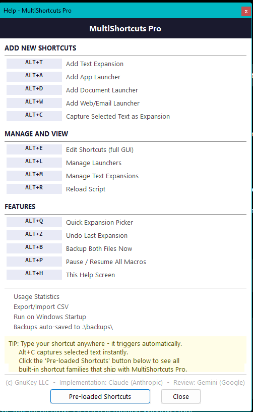
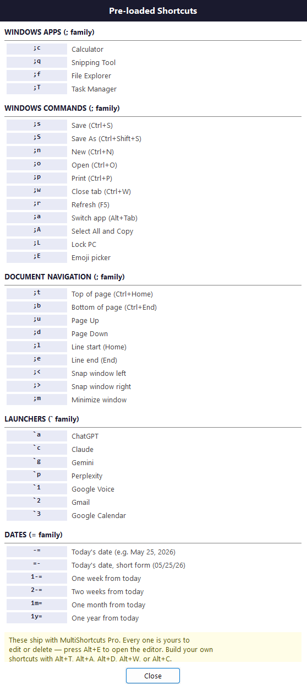

# MultiShortcuts Pro

**MultiShortcuts Pro** is a free AutoHotkey v2 productivity tool for Windows, published by **GnuKey LLC**.

It lets you use short typed codes and hotkeys to expand text, launch apps and websites, open documents, insert dates, capture selected text, manage shortcuts, and trigger common productivity actions.

Website: https://multishortcutspro.speedkee.com

---

## Screenshots

---

## Requirements

- Windows 10 or Windows 11
- AutoHotkey v2

Download AutoHotkey v2 here:

https://www.autohotkey.com/

---

## Download

Download the latest version from the **Releases** page.

The main program file is:

`MultiShortcutsPro.ahk`

---

## What MultiShortcuts Pro can do

MultiShortcuts Pro includes tools for:

- Text expansions
- App and website launchers
- Document launchers
- Date shortcuts
- Capturing selected text as a shortcut
- Editing and managing shortcuts
- F-Key actions
- Expansion history and undo
- Usage statistics
- Backups
- CSV import and export

---

## Quick start

1. Install AutoHotkey v2.
2. Download `MultiShortcutsPro.ahk` from the latest release.
3. Double-click `MultiShortcutsPro.ahk`.
4. Right-click the MultiShortcuts Pro tray icon to open the menu.

---

## Privacy

MultiShortcuts Pro runs locally on your computer.

Your shortcuts are stored in local plain-text files. The script does not require an account, subscription, telemetry service, or cloud account.

You can open the `.ahk` file in a text editor and inspect the code.

---

## Support

For bug reports, you can open a GitHub Issue or email:

support.team@gnukey.com

---

## License

MIT License.